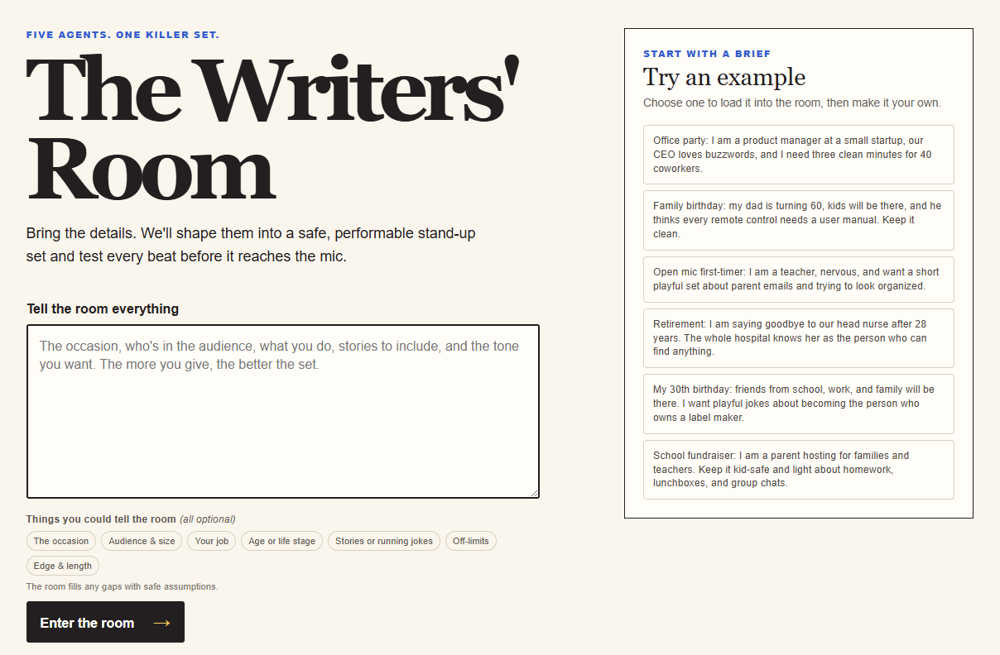
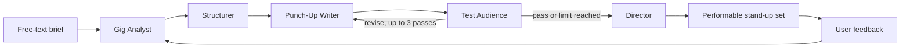

# The Writers' Room

The Writers' Room turns a single free-text brief into a safe, performable stand-up set for an office party, birthday, wedding, open mic, or other everyday occasion. Give the room as much or as little detail as you have, watch its five agents work live, then refine the finished set in plain language.

The result includes a title, delivery-marked set text, duration estimate, practical delivery tips, and the assumptions the room made to fill any gaps safely.

# Live Demo URL

https://the-writers-room.vercel.app/

# Demo video

https://www.youtube.com/watch?v=4X2NHqVYJCA

# Screenshot



## Five-agent architecture

Each agent reads the shared state and returns structured JSON. The UI streams every agent's progress over SSE, while the completed state remains in the browser so refinements work on serverless deployments.



| Agent | Role |
| --- | --- |
| Gig Analyst | Extracts the occasion, audience, safety constraints, usable personal material, safe assumptions, and the refinement type. |
| Structurer | Turns the material into a set list with an opener, bits, callbacks, and a closer. |
| Punch-Up Writer | Writes and revises the performable beat-by-beat stand-up draft. |
| Test Audience | Generates audience-specific personas, reacts to every beat, and returns a pass/revise verdict. |
| Director | Produces the final set, delivery marks, duration estimate, and first-time performer tips. |

Safety is built into the flow: children trigger clean mode, grief-adjacent contexts receive warm clean treatment, personal stories are never fabricated, and the audience is never the punchline.

## Setup

Requirements: Node.js 20+ and an OpenAI API key.

```bash
npm install
cp .env.example .env.local
```

Set `OPENAI_API_KEY` in `.env.local`, then start the development server:

```bash
npm run dev
```

Open [http://localhost:3000](http://localhost:3000). The default model is `gpt-5.6`; set `OPENAI_MODEL` in `.env.local` to override it. `OPENAI_PROJECT` and `OPENAI_ORGANIZATION` are available for legacy multi-project setups.

For a production check:

```bash
npm run build
npm run start
```

## Sample briefs

These are the same examples offered on the landing page — click one there, or paste one here:

> **Office party:** I am a product manager at a small startup, our CEO loves buzzwords, and I need three clean minutes for 40 coworkers.

> **Family birthday:** my dad is turning 60, kids will be there, and he thinks every remote control needs a user manual. Keep it clean.

> **Open mic first-timer:** I am a teacher, nervous, and want a short playful set about parent emails and trying to look organized.

> **Retirement:** I am saying goodbye to our head nurse after 28 years. The whole hospital knows her as the person who can find anything.

> **My 30th birthday:** friends from school, work, and family will be there. I want playful jokes about becoming the person who owns a label maker.

> **School fundraiser:** I am a parent hosting for families and teachers. Keep it kid-safe and light about homework, lunchboxes, and group chats.

The more true detail you add — real stories, exact quotes, who is in the room — the more the set becomes yours. Briefs with one or two true stories consistently outperform briefs with none.

## How GPT-5.6 was used

GPT-5.6 powers all five role-specific agents. Their system prompts are plain-text files in [`prompts/`](./prompts), making each role inspectable and easy to tune. The model does the creative heavy lifting this product depends on:

- **The multi-agent revision loop.** The Punch-Up Writer drafts, the Test Audience generates personas from the audience composition (an office crowd gets an HR persona and a department head; a family party gets a grandmother and a nine-year-old) and reviews every beat with a reaction and a reason, and the writer revises against those notes for up to three passes. No joke ships unreviewed.
- **Feedback routing.** On refinement, the Gig Analyst classifies the user's plain-language feedback as structural (rebuild the set list) or surface (rewrite specific beats), so small changes stay fast and cheap.
- **Safety reasoning.** The Analyst infers constraints the user never stated: children in the audience force clean mode, grief-adjacent occasions disable roasting, risky topics land in an off-limits list that two downstream agents enforce.

All agent calls use JSON mode with a retry wrapper, so five agents can exchange structured state reliably.

## How Codex accelerated the build

This project went from an empty repo to a deployed product in three days, and Codex (CLI, in VS Code) did the majority of the implementation. The workflow: I wrote decisions into spec files, Codex turned them into working code.

- **Scaffold from spec.** [`docs/spec.md`](./docs/spec.md) described v1 (state object, agent prompts, orchestration pseudocode). A single Codex session produced the working Next.js app: orchestrator, prompt files, SSE streaming route, and UI.
- **A full product pivot in one session.** Midway through, I decided the v1 interview flow was wrong and rewrote the concept as [`docs/spec-v2.md`](./docs/spec-v2.md) (see Process below). Codex executed the migration — removed an entire agent, reworked the state object, rebuilt the landing flow — without breaking the working pipeline.
- **Production hardening.** Codex implemented the stateless refinement flow (the client holds the completed state and sends it back, so refinement survives serverless deployments), the abuse rate-limiting on the API route, and the agent-card presentation layer that turns raw inter-agent JSON into a readable live feed.
- **Debugging under deadline.** Intermittent API failures were diagnosed by instrumenting the orchestrator, then absorbed with retry/backoff and JSON mode — small changes that made the difference between a demo that sometimes breaks and one that doesn't.

Where the key decisions were human: the five-agent writers' room design, the decision to kill the interview and trust one free-text box, the safety guardrails, and every judgment about whether the comedy was actually good. Codex made the implementation cheap enough that a one-person team could afford a mid-hackathon pivot.

## Process

### The pivot: killing the interview

Version one of The Writers' Room was an interview: an agent asked up to six questions, one at a time, before any writing began. Testing it on myself was humbling — my answers got shorter with every question, and by question three I was replying "I can't." If the builder won't finish the interview, users never will.

So the product pivoted to a single freewriting text box, documented in [`docs/spec-v2.md`](./docs/spec-v2.md). When I am not forced to answer structured questions, I willingly share more — and the sets got better, because the writers finally had real material. Since there is no interview to fill gaps, the Gig Analyst now displays every assumption it makes ("The room assumed: …"), so transparency replaces interrogation.


### The Test Audience became the product

The Test Audience began as a quality gate and turned into the heart of the app. Watching an HR persona wince at a workplace joke, or a nine-year-old persona say a bit is "a little hard to understand," is both the quality mechanism and the show. Its notes are specific enough to act on — in one run it rejected a beat with "replace the abstract tag with one concrete escalation that children and adults can immediately picture," and the revised draft was measurably better. The live feed renders this argument as it happens, because the inter-agent negotiation *is* the product demo.

### Input quality beats prompt engineering

The same pipeline produces generic observational comedy from a thin brief ("I'm a product manager, office party") and a genuinely personal set from a rich one (a retirement brief with three true stories used every one of them, including turning a plant-naming habit into the closer). No prompt tuning changed outputs as much as one true story in the brief did. That finding shaped the landing page: optional hint chips nudge users toward the occasion, the audience, true stories, and off-limits topics — without mandating any of them.

### Dogfooding on a real deadline

I used the app to prepare a three-minute set for a realistic scenario — a novice stand-up competition in a Berlin bar — built from my real background as a non-EU foreigner living in Germany. I suspect briefs written in natural, unpolished language produce more performable sets, but I haven't tested this enough to claim it. The refinement box got used the way a comedian uses a writing partner: "the jokes are shallow and unsmart," "add more jokes about taking the train across borders."

